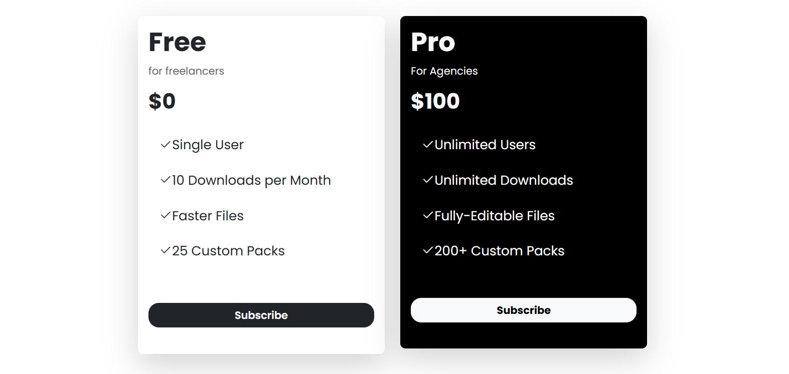

# udemy-boostrap-course

Boostrap projects that i have developed for udemy boostrap course

## Starter Template for scss

[Open the guide](./bs5-scss-starter//README.md)

## Projects

### Pricing Cards

[Link to the code](pricing-cards/index.html)

> This is project is done in 1.12.2025

  
Click for more info

 

