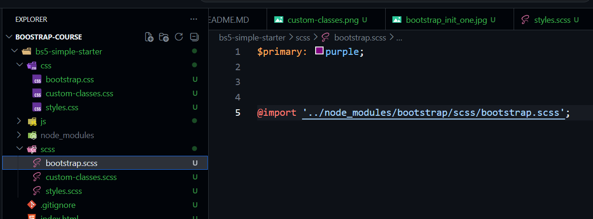
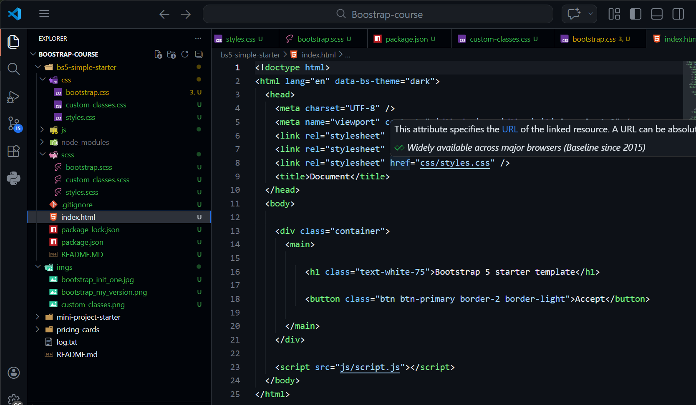
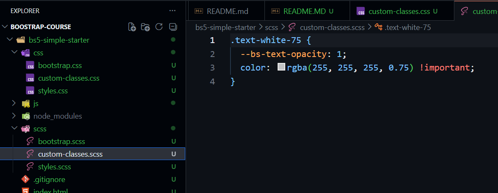
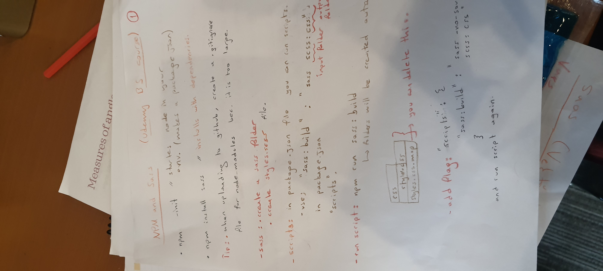

## Installation and configuration of scss

[My Physical Notes](#my-notes)

### Overriding default scss with my version

created bootstrap.scss and added my custom variables, saved then compiled...
 
using "sass: watch" in scripts for auto compiletion
 

### Adding to my index.html the link of css

added the generated bootstrap.css to my page
 

### Custom Classes Creation

created custom classes in .scss format and added index.html as css
 

### My notes

